# Culino 数据库 ER 图

## 概览

数据库使用 PostgreSQL，共 **22 张表**，分为 6 个模块：

| 模块    | 表数量 | 说明              |
|-------|-----|-----------------|
| 用户体系  | 4   | 用户、角色、权限        |
| 基础数据  | 3   | 食材、调料、分类        |
| 标签    | 1   | 多类型标签           |
| 菜谱核心  | 6   | 菜谱及关联数据         |
| 互动功能  | 5   | 收藏、点赞、评论、烹饪记录   |
| 工具功能  | 3   | 购物清单、周菜单        |
| AI 功能 | 4   | 营养分析、推荐、偏好、行为日志 |

## ER 图

```mermaid
erDiagram
    %% ========== 用户体系 ==========
    roles {
        SERIAL id PK
        VARCHAR code UK
        VARCHAR name
        VARCHAR description
    }

    permissions {
        SERIAL id PK
        VARCHAR code UK
        VARCHAR name
        VARCHAR module
    }

    role_permissions {
        INT role_id PK,FK
        INT permission_id PK,FK
    }

    users {
        UUID id PK
        VARCHAR username UK
        VARCHAR nickname
        VARCHAR password_hash
        VARCHAR avatar
        INT role_id FK
        BOOLEAN is_active
        TIMESTAMPTZ created_at
        TIMESTAMPTZ updated_at
    }

    roles ||--o{ role_permissions : "has"
    permissions ||--o{ role_permissions : "granted_to"
    roles ||--o{ users : "assigned_to"

    %% ========== 基础数据 ==========
    ingredient_categories {
        SERIAL id PK
        VARCHAR name UK
        INT sort_order
    }

    ingredients {
        SERIAL id PK
        VARCHAR name UK
        INT category_id FK
        VARCHAR unit
        VARCHAR image
        TIMESTAMPTZ created_at
    }

    seasonings {
        SERIAL id PK
        VARCHAR name UK
        VARCHAR unit
        VARCHAR image
        TIMESTAMPTZ created_at
    }

    ingredient_categories ||--o{ ingredients : "contains"

    %% ========== 标签 ==========
    tags {
        SERIAL id PK
        VARCHAR name UK
        VARCHAR type
        VARCHAR color
        INT sort_order
    }

    %% ========== 菜谱核心 ==========
    recipes {
        UUID id PK
        VARCHAR title
        TEXT description
        VARCHAR cover_image
        SMALLINT difficulty
        INT cooking_time
        INT prep_time
        SMALLINT servings
        VARCHAR source
        UUID author_id FK
        SMALLINT status
        TIMESTAMPTZ created_at
        TIMESTAMPTZ updated_at
    }

    recipe_ingredients {
        SERIAL id PK
        UUID recipe_id FK
        INT ingredient_id FK
        VARCHAR amount
        VARCHAR unit
        VARCHAR note
        INT sort_order
    }

    recipe_seasonings {
        SERIAL id PK
        UUID recipe_id FK
        INT seasoning_id FK
        VARCHAR amount
        VARCHAR unit
        INT sort_order
    }

    recipe_steps {
        SERIAL id PK
        UUID recipe_id FK
        INT step_number
        TEXT content
        VARCHAR image
        INT duration
    }

    recipe_tags {
        UUID recipe_id PK,FK
        INT tag_id PK,FK
    }

    users ||--o{ recipes : "creates"
    recipes ||--o{ recipe_ingredients : "uses"
    ingredients ||--o{ recipe_ingredients : "used_in"
    recipes ||--o{ recipe_seasonings : "uses"
    seasonings ||--o{ recipe_seasonings : "used_in"
    recipes ||--o{ recipe_steps : "has"
    recipes ||--o{ recipe_tags : "tagged"
    tags ||--o{ recipe_tags : "applied_to"

    %% ========== 互动功能 ==========
    favorites {
        UUID user_id PK,FK
        UUID recipe_id PK,FK
        TIMESTAMPTZ created_at
    }

    recipe_likes {
        UUID user_id PK,FK
        UUID recipe_id PK,FK
        TIMESTAMPTZ created_at
    }

    recipe_comments {
        UUID id PK
        UUID recipe_id FK
        UUID user_id FK
        TEXT content
        TIMESTAMPTZ created_at
    }

    cooking_logs {
        UUID id PK
        UUID recipe_id FK
        UUID user_id FK
        SMALLINT rating
        TEXT note
        DATE cooked_at
        TIMESTAMPTZ created_at
        TIMESTAMPTZ updated_at
    }

    users ||--o{ favorites : "collects"
    recipes ||--o{ favorites : "collected_by"
    users ||--o{ recipe_likes : "likes"
    recipes ||--o{ recipe_likes : "liked_by"
    users ||--o{ recipe_comments : "writes"
    recipes ||--o{ recipe_comments : "has"
    users ||--o{ cooking_logs : "records"
    recipes ||--o{ cooking_logs : "cooked_in"

    %% ========== 工具功能 ==========
    shopping_lists {
        UUID id PK
        UUID user_id FK
        VARCHAR title
        SMALLINT status
        TIMESTAMPTZ created_at
    }

    shopping_list_items {
        SERIAL id PK
        UUID list_id FK
        VARCHAR name
        VARCHAR amount
        BOOLEAN is_checked
        INT sort_order
    }

    meal_plans {
        UUID id PK
        UUID user_id FK
        UUID recipe_id FK
        DATE plan_date
        SMALLINT meal_type
        VARCHAR note
    }

    users ||--o{ shopping_lists : "owns"
    shopping_lists ||--o{ shopping_list_items : "contains"
    users ||--o{ meal_plans : "plans"
    recipes ||--o{ meal_plans : "scheduled_in"

    %% ========== AI 功能 ==========
    recipe_nutrition {
        UUID recipe_id PK,FK
        DECIMAL calories
        DECIMAL protein
        DECIMAL fat
        DECIMAL carbohydrate
        DECIMAL fiber
        DECIMAL sodium
        TEXT analysis_text
        SMALLINT health_score
        TEXT_ARRAY health_tags
        TEXT_ARRAY suitable_for
        TEXT_ARRAY cautions
        TEXT serving_size
        JSONB traffic_light
        VARCHAR overall_rating
        TEXT summary
        TIMESTAMPTZ generated_at
        TIMESTAMPTZ updated_at
    }

    user_preferences {
        UUID user_id PK,FK
        JSONB favorite_cuisines
        JSONB favorite_tastes
        JSONB favorite_ingredients
        JSONB favorite_tags
        TEXT_ARRAY dietary_restrictions
        TEXT_ARRAY health_goals
        INT avg_cooking_time
        SMALLINT difficulty_preference
        INT total_favorites
        INT total_cooking_logs
        DECIMAL avg_rating
        TIMESTAMPTZ last_analyzed_at
        TIMESTAMPTZ updated_at
    }

    ai_recommendations {
        UUID id PK
        UUID user_id FK
        UUID recipe_id FK
        VARCHAR recommendation_type
        DECIMAL score
        TEXT reason
        BOOLEAN clicked
        TIMESTAMPTZ clicked_at
        TIMESTAMPTZ created_at
    }

    user_behavior_logs {
        UUID id PK
        UUID user_id FK
        UUID recipe_id FK
        VARCHAR action_type
        JSONB action_value
        TIMESTAMPTZ created_at
    }

    recipes ||--|| recipe_nutrition : "analyzed_as"
    users ||--|| user_preferences : "profiled_as"
    users ||--o{ ai_recommendations : "receives"
    recipes ||--o{ ai_recommendations : "recommended_in"
    users ||--o{ user_behavior_logs : "generates"
    recipes ||--o{ user_behavior_logs : "tracked_in"
```

## 模块关系说明

### 用户体系

- `users` 通过 `role_id` 关联 `roles`，实现 RBAC 权限控制
- `role_permissions` 为角色-权限多对多关联表

### 菜谱核心

- `recipes` 是核心实体，通过关联表连接食材、调料、步骤、标签
- `recipe_ingredients` / `recipe_seasonings` 的 `amount` 字段为 VARCHAR，支持 "适量"、"2勺" 等自由文本

### AI 功能

- `recipe_nutrition` 与 `recipes` 一对一，存储 AI 生成的营养分析
- `user_preferences` 与 `users` 一对一，存储 AI 计算的用户画像
- `ai_recommendations` 记录推荐结果及用户点击反馈
- `user_behavior_logs` 记录用户行为，作为推荐系统训练数据
